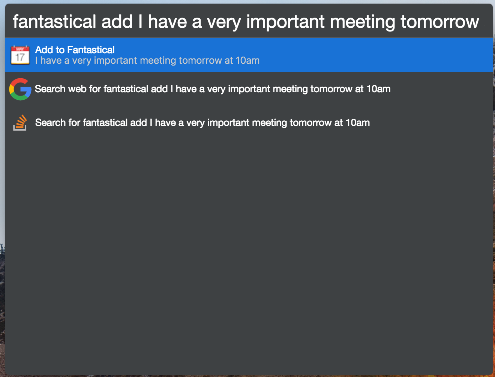

# cerebro-fantastical

> [Cerebro](https://cerebroapp.com) plugin to quickly add to Fantastical.

## Usage

In Cerebro, type `fantastical add` and any text to be parsed by Fantastical.

You may also type `fantastical open` and select whether to open the mini version or the full app.

## Installing

- Type `plugins fantastical` into Cerebro
- Click `install`

## Related

- [Cerebro](http://github.com/KELiON/cerebro) – main repo for Cerebro app;

## License

MIT © [Matthew Jacobs](https://www.matthewjacobs.io)
